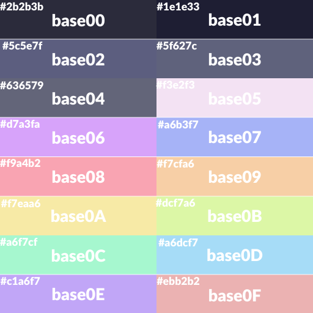

# sorbet dark

## Preview

## Colours

base00 hsl(240, 15%, 20%) #2b2b3b

base01 hsl(240, 26%, 16%) #1e1e33

base02 hsl(237, 16%, 43%) #5c5e7f

base03 hsl(234, 13%, 43%) #5f627c

base04 hsl(233, 10%, 43%) #636579

base05 hsl(300, 64%, 85%) #f1c0f1

base06 hsl(276, 90%, 81%) #d7a3fa

base07 hsl(230, 84%, 81%) #a6b3f7

base08 hsl(350, 88%, 81%) #f9a4b2

base09 hsl(390, 84%, 81%) #f7cfa6

base0A hsl(410, 84%, 81%) #f7eaa6

base0B hsl(80, 84%, 81%) #dcf7a6

base0C hsl(150, 84%, 81%) #a6f7cf

base0D hsl(200, 84%, 81%) #a6dcf7

base0E hsl(260, 84%, 81%) #c1a6f7

base0F hsl(0, 59%, 81%) #ebb2b2
